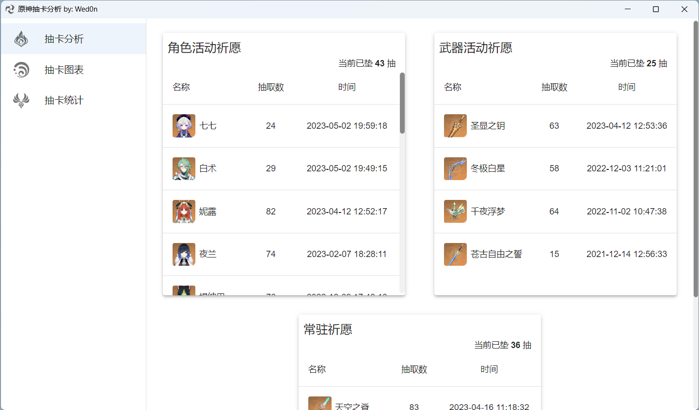
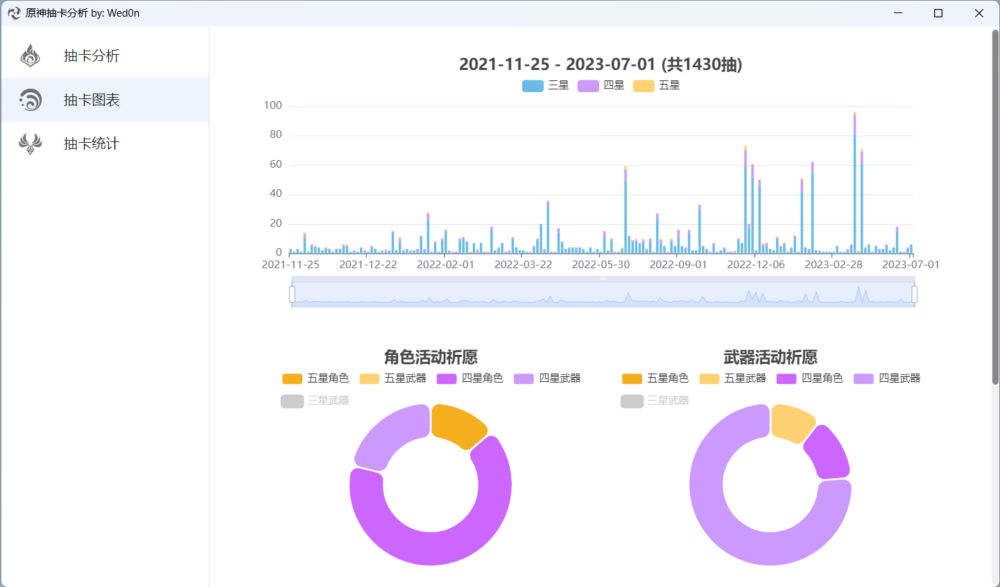
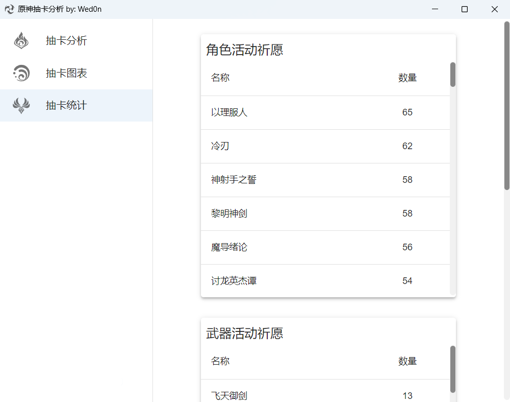
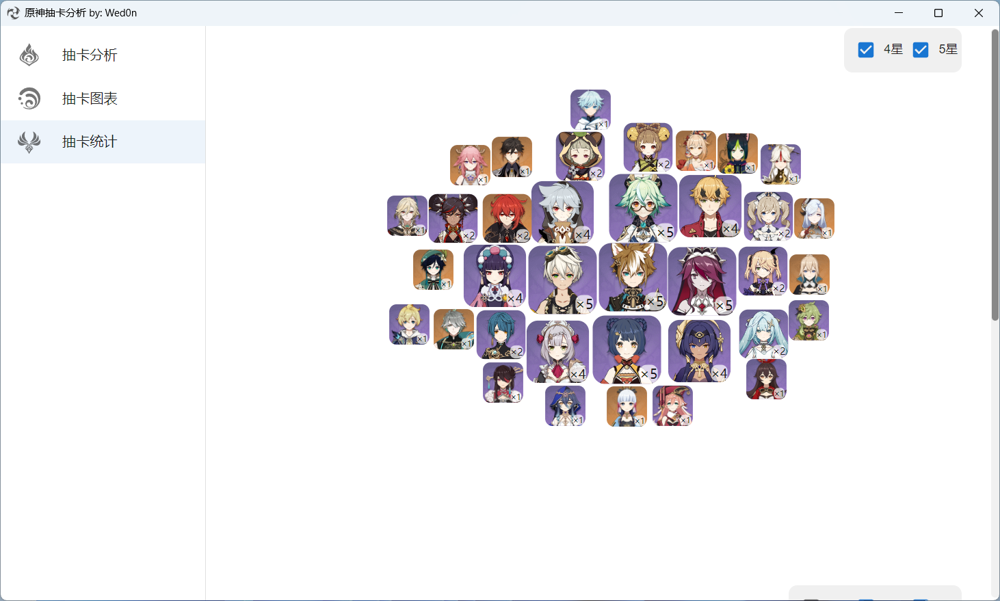

# 原神祈愿分析
## 功能
- 获取原神祈愿记录
- 分析原神祈愿记录
- 祈愿记录可在本地永久保存
## 使用方法
直接运行即可,成功获取祈愿记录后会在当前目录下生成以UID命名的Sqlite3数据库文件。
**注意**: 移动程序文件时不要漏掉数据库文件。

## 截图

  
  
  
  

## 感谢
本程序获取原神祈愿链接的方法来自这里 [lgou2w/genshin-gacha](https://github.com/lgou2w/genshin-gacha)
## 开源协议
MIT